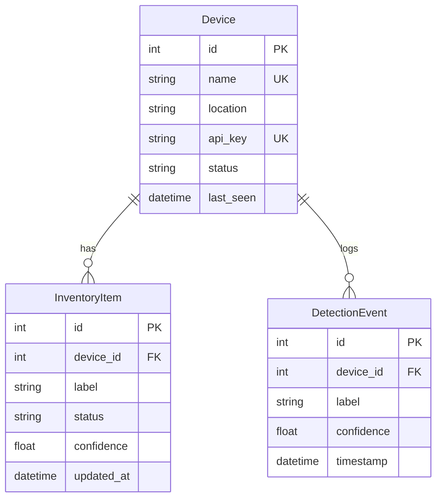

# Backend — Flask REST API

The backend is a **Flask** REST API that receives radar classification results from edge devices, stores them in a SQLite database, and serves data to the frontend dashboard.

---

## Tech Stack

| Technology | Version | Purpose |
|-----------|---------|---------|
| Flask | 3.1.0 | Lightweight Python web framework |
| Flask-SQLAlchemy | 3.1.1 | ORM for database access |
| Flask-CORS | 5.0.1 | Cross-origin requests (Next.js on port 3000 → Flask on port 5000) |
| SQLite | built-in | File-based relational database (`inventory.db`) |
| Marshmallow | 3.23.2 | Serialisation / validation (available) |
| Python-dotenv | 1.0.1 | Environment variable loading |

---

## File Structure

```
Serverapp/
├── app.py               # Flask application factory
├── models.py            # SQLAlchemy database models
├── requirements.txt     # Python dependencies
├── inventory.db         # SQLite database (auto-created)
├── test_api.py          # End-to-end API test suite
├── setup_and_run.bat    # Windows: install deps + start both servers
├── setup_and_run.ps1    # PowerShell: install deps + start both servers
│
└── routes/              # Flask Blueprints (one per resource)
    ├── __init__.py
    ├── devices.py       # Device registration & management
    ├── detections.py    # Detection event ingestion & history
    └── inventory.py     # Current inventory state & stats
```

---

## Flask — Quick Primer

Flask is a minimal Python web framework. A few core concepts:

### Application Factory (`app.py`)

Instead of a global `app` object, this project uses the **factory pattern**:

```python
def create_app():
    app = Flask(__name__)
    # configure database, CORS, register blueprints ...
    return app
```

This makes it easy to create separate instances for testing vs. production.

### Blueprints (Route Modules)

Routes are organised by resource into `Blueprint` objects, then registered on the app:

```python
# routes/devices.py
devices_bp = Blueprint("devices", __name__)

@devices_bp.route("/api/devices", methods=["GET"])
def list_devices():
    ...

# app.py
app.register_blueprint(devices_bp)
```

### Request / Response Cycle

```python
from flask import request, jsonify

@app.route("/api/example", methods=["POST"])
def example():
    data = request.get_json()          # Parse JSON body
    api_key = request.headers.get("X-API-Key")  # Read header
    device_id = request.args.get("device_id")   # Query param

    return jsonify({"message": "ok"}), 201       # JSON response + status
```

### SQLAlchemy ORM

Models are Python classes that map to database tables:

```python
class Device(db.Model):
    __tablename__ = "devices"
    id = db.Column(db.Integer, primary_key=True)
    name = db.Column(db.String(100), unique=True)
    ...
```

Common operations:
```python
Device.query.all()                      # SELECT * FROM devices
Device.query.get(1)                     # SELECT ... WHERE id = 1
Device.query.filter_by(name="foo")      # SELECT ... WHERE name = 'foo'
db.session.add(device)                  # INSERT
db.session.commit()                     # Commit transaction
db.session.delete(device)               # DELETE
```

---

## Database Models (`models.py`)

Three SQLAlchemy models map to three tables:

### `Device`

| Column | Type | Description |
|--------|------|-------------|
| `id` | Integer (PK) | Auto-incremented device ID |
| `name` | String(100) | Unique device name (e.g. `psoc6-01`) |
| `location` | String(200) | Physical location |
| `api_key` | String(64) | 64-char hex token, generated on registration |
| `status` | String(20) | `"online"` or `"offline"` |
| `last_seen` | DateTime | Updated on every detection POST |
| `created_at` | DateTime | Registration timestamp |

### `InventoryItem`

| Column | Type | Description |
|--------|------|-------------|
| `id` | Integer (PK) | Auto-incremented |
| `device_id` | Integer (FK → devices) | Which device detected this |
| `label` | String(100) | Classification label (e.g. `empty_box`) |
| `status` | String(20) | `"detected"` or `"cleared"` |
| `confidence` | Float | Model confidence (0.0–1.0) |
| `updated_at` | DateTime | Last update timestamp |

> One inventory item per `(device_id, label)` pair — upserted on each detection.

### `DetectionEvent`

| Column | Type | Description |
|--------|------|-------------|
| `id` | Integer (PK) | Auto-incremented |
| `device_id` | Integer (FK → devices) | Source device |
| `label` | String(100) | Classification label |
| `confidence` | Float | Model confidence |
| `timestamp` | DateTime | When the detection occurred |

> Append-only log — every detection creates a new row.

### Entity Relationship



---

## API Routes

All routes are prefixed with `/api/`.

### Health

| Method | Endpoint | Description | Auth |
|--------|----------|-------------|------|
| `GET` | `/api/health` | Returns `{"status": "ok"}` | None |

### Devices

| Method | Endpoint | Description | Auth |
|--------|----------|-------------|------|
| `GET` | `/api/devices` | List all devices | None |
| `GET` | `/api/devices/<id>` | Get device by ID | None |
| `POST` | `/api/devices` | Register new device | None |
| `PUT` | `/api/devices/<id>` | Update name/location | None |
| `DELETE` | `/api/devices/<id>` | Delete device + cascade | None |

**POST body:**
```json
{ "name": "psoc6-01", "location": "Warehouse A" }
```

**Response (201):**
```json
{
  "id": 4,
  "name": "psoc6-01",
  "location": "Warehouse A",
  "api_key": "a3f8c1...",
  "status": "online",
  "last_seen": "2026-02-22T21:00:00",
  "created_at": "2026-02-22T21:00:00"
}
```

### Detections

| Method | Endpoint | Description | Auth |
|--------|----------|-------------|------|
| `POST` | `/api/detections` | Submit a detection event | `X-API-Key` |
| `GET` | `/api/detections` | Query detection history | None |

**POST body:**
```json
{
  "device_id": 4,
  "label": "empty_box",
  "confidence": 0.87,
  "status": "detected"
}
```

**Required header:** `X-API-Key: <device_api_key>`

**Query params (GET):** `device_id`, `label`, `limit` (default 50)

### Inventory

| Method | Endpoint | Description | Auth |
|--------|----------|-------------|------|
| `GET` | `/api/inventory` | Current inventory state | None |
| `GET` | `/api/inventory/stats` | Aggregated dashboard stats | None |

**Query params (GET /inventory):** `device_id`, `label`, `status`

**Stats response:**
```json
{
  "total_items": 12,
  "items_by_label": {
    "empty_box": { "detected": 3, "cleared": 1 },
    "table": { "detected": 2, "cleared": 0 }
  },
  "active_devices": 2,
  "total_devices": 3,
  "total_detections": 156,
  "recent_detections": 8
}
```

---

## Authentication

Detection submissions use API-key authentication:

1. Device registers via `POST /api/devices` → server returns `api_key`
2. Device includes `X-API-Key: <key>` header on every `POST /api/detections`
3. Server verifies the key matches the `device_id` in the body
4. Returns `401` (missing key), `403` (wrong key), or `404` (device not found) on failure

---

## Important Functions

### `create_app()` — `app.py`
Application factory. Configures SQLite, CORS, creates tables, registers all blueprints.

### `create_detection()` — `routes/detections.py`
The most critical endpoint. Called by edge devices every cycle:
1. Authenticates via `X-API-Key` header
2. Updates `device.last_seen` + `device.status`
3. Creates a `DetectionEvent` (append-only log)
4. **Upserts** an `InventoryItem` — updates if `(device_id, label)` exists, inserts otherwise

### `get_inventory_stats()` — `routes/inventory.py`
Aggregates data for the dashboard: item counts by label, active devices (seen in last 5 min), total/recent detection counts.

---

## Running

### Development (recommended)

```bash
# From Serverapp/
python -m venv venv
venv\Scripts\activate          # Windows
pip install -r requirements.txt
python app.py
```

Server starts at `http://0.0.0.0:5000`.

### Automated Setup

```bash
# Installs all deps and starts both backend + frontend:
setup_and_run.bat      # Windows CMD
setup_and_run.ps1      # PowerShell
```

### Testing

```bash
python test_api.py
```

Runs 7 sequential tests: health check → register device → list devices → post detection → check inventory → check stats → cleanup (delete device).

---

## Workflow

```
┌─────────────────────────────────────────────────────────────┐
│                    Edge Device (PSoC6)                       │
│   POST /api/detections  { label, confidence, device_id }    │
│   Header: X-API-Key: abc123...                              │
└───────────────────────────┬─────────────────────────────────┘
                            │
                            ▼
┌─────────────────────────────────────────────────────────────┐
│                Flask Backend (:5000)                         │
│                                                             │
│  1. Authenticate API key                                    │
│  2. Update device.last_seen                                 │
│  3. INSERT into detection_events (history log)              │
│  4. UPSERT into inventory_items (current state)             │
│  5. Return 201 + event + inventory_item JSON                │
└───────────────────────────┬─────────────────────────────────┘
                            │
                            ▼
┌─────────────────────────────────────────────────────────────┐
│             Next.js Frontend (:3000)                         │
│   Polls GET /api/inventory, /api/detections, /api/stats     │
│   every 5 seconds to update the dashboard                   │
└─────────────────────────────────────────────────────────────┘
```
