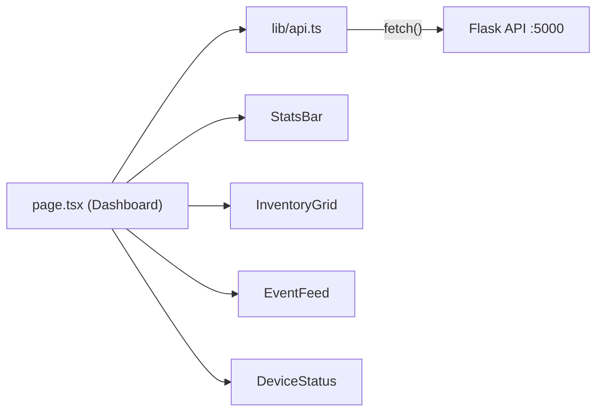

# Frontend — Next.js Dashboard

A real-time inventory dashboard built with **Next.js 16**, **React 19**, and **TypeScript**. Features a modern glassmorphism dark-mode design with live auto-refresh.

---

## Tech Stack

| Technology | Version | Purpose |
|-----------|---------|---------|
| Next.js | 16.1.6 | React framework (App Router) |
| React | 19.2.3 | UI library |
| TypeScript | 5.x | Type safety |
| Vanilla CSS | — | Glassmorphism design system (no Tailwind) |
| Inter (Google Fonts) | — | Typography |

---

## File Structure

```
frontend/
├── app/                     # Next.js App Router (pages + layout)
│   ├── layout.tsx           # Root HTML layout + metadata
│   ├── page.tsx             # Dashboard page (main entry)
│   ├── globals.css          # Full design system (510 lines)
│   └── favicon.ico
│
├── components/              # React components
│   ├── StatsBar.tsx         # Top stats cards (items, devices, detections)
│   ├── InventoryGrid.tsx    # Inventory item cards with confidence bars
│   ├── EventFeed.tsx        # Live detection event timeline
│   └── DeviceStatus.tsx     # Device online/offline list
│
├── lib/                     # Shared utilities
│   └── api.ts               # API client + TypeScript interfaces
│
├── public/                  # Static assets
├── package.json             # Dependencies and scripts
├── tsconfig.json            # TypeScript configuration
├── next.config.ts           # Next.js configuration
└── eslint.config.mjs        # ESLint rules
```

---

## Architecture Overview

The app uses the **Next.js App Router** with a single client-side page that polls the Flask backend every 5 seconds.



### Data Flow

1. `page.tsx` calls `fetchData()` on mount and every 5 seconds
2. `fetchData()` fires 4 parallel `fetch()` calls via `lib/api.ts`
3. Results are stored in React state and passed as props to components
4. Components render the data with loading shimmer states

---

## API Client (`lib/api.ts`)

Centralised data-fetching module with full TypeScript types.

### Configuration

```typescript
const API_BASE = process.env.NEXT_PUBLIC_API_URL || "http://localhost:5000";
```

Set `NEXT_PUBLIC_API_URL` to override the backend URL (e.g. for production).

### TypeScript Interfaces

| Interface | Fields | Source Endpoint |
|-----------|--------|----------------|
| `Device` | id, name, location, api_key, status, last_seen, created_at | `/api/devices` |
| `InventoryItem` | id, device_id, device_name, device_location, label, status, confidence, updated_at | `/api/inventory` |
| `DetectionEvent` | id, device_id, device_name, label, confidence, timestamp | `/api/detections` |
| `InventoryStats` | total_items, items_by_label, active_devices, total_devices, total_detections, recent_detections | `/api/inventory/stats` |

### Fetcher Functions

| Function | Endpoint | Returns |
|----------|----------|---------|
| `getDevices()` | `GET /api/devices` | `Device[]` |
| `getInventory()` | `GET /api/inventory` | `InventoryItem[]` |
| `getInventoryStats()` | `GET /api/inventory/stats` | `InventoryStats` |
| `getDetections(limit)` | `GET /api/detections?limit=N` | `DetectionEvent[]` |

All fetchers use a shared `fetchJSON<T>()` helper with `{ cache: "no-store" }` to bypass Next.js caching.

---

## Components

### `StatsBar.tsx`

Four summary cards displayed at the top of the dashboard:

| Card | Data Source | Icon |
|------|------------|------|
| Inventory Items | `stats.total_items` | 📦 |
| Active Devices | `stats.active_devices / stats.total_devices` | 📡 |
| Recent (1h) | `stats.recent_detections` | ⚡ |
| Total Detections | `stats.total_detections` | 📊 |

Shows loading shimmer skeletons while data is being fetched.

### `InventoryGrid.tsx`

Responsive grid of inventory item cards. Each card shows:
- Label (e.g. "empty box") with status badge (`detected` / `cleared`)
- Device name + location
- Relative timestamp (e.g. "3m ago")
- Confidence percentage with animated progress bar

**Helper functions:**
- `formatTime(iso)` — converts ISO timestamp to relative time string
- `formatLabel(label)` — replaces underscores with spaces

### `EventFeed.tsx`

Scrollable timeline of the most recent detection events (last 30). Each entry shows:
- Colored dot (green for detected)
- Label + device name + confidence percentage
- Relative timestamp

### `DeviceStatus.tsx`

List of all registered devices with online/offline indicators.

**Online logic:** A device is considered online if `last_seen` is within the last 5 minutes:
```typescript
function isOnline(lastSeen: string | null): boolean {
    if (!lastSeen) return false;
    const diff = Date.now() - new Date(lastSeen).getTime();
    return diff < 5 * 60 * 1000;
}
```

---

## Design System (`globals.css`)

The dashboard uses a custom glassmorphism dark-mode design with CSS custom properties.

### Color Palette

| Variable | Hex | Usage |
|----------|-----|-------|
| `--bg-primary` | `#0a0e1a` | Page background |
| `--bg-card` | `rgba(17, 24, 39, 0.7)` | Semi-transparent card backgrounds |
| `--accent-blue` | `#3b82f6` | Primary accent, headings |
| `--accent-cyan` | `#06b6d4` | Secondary accent, gradients |
| `--accent-emerald` | `#10b981` | Online status, detected badges |
| `--accent-amber` | `#f59e0b` | Warning, stats |
| `--accent-rose` | `#f43f5e` | Error states |

### Key Design Elements

| Element | CSS Class | Effect |
|---------|-----------|--------|
| Glass cards | `.glass-card` | Semi-transparent bg + `backdrop-filter: blur(20px)` + border glow on hover |
| Loading states | `.loading-shimmer` | Animated gradient sweep skeleton |
| Status dot | `.status-dot` | Pulsing green circle (2s animation) |
| Confidence bar | `.confidence-bar-fill` | Blue→cyan gradient, animated width |
| Event entrance | `.event-item` | `fadeSlideIn` animation (0.3s) |

### Responsive Breakpoints

| Breakpoint | Changes |
|-----------|---------|
| ≤ 1024px | Stats: 2 columns, main grid: single column |
| ≤ 640px | Stats: 1 column, reduced padding |

---

## Dashboard Page (`page.tsx`)

The main page is a client component (`"use client"`) that manages all state:

```typescript
const REFRESH_INTERVAL = 5000; // Auto-refresh every 5 seconds

const [stats, setStats]       = useState<InventoryStats | null>(null);
const [inventory, setInventory] = useState<InventoryItem[]>([]);
const [events, setEvents]     = useState<DetectionEvent[]>([]);
const [devices, setDevices]   = useState<Device[]>([]);
const [loading, setLoading]   = useState(true);
const [error, setError]       = useState<string | null>(null);
```

**Features:**
- Header with live/disconnected status indicator
- Error banner when the Flask backend is unreachable
- All 4 API endpoints fetched in parallel via `Promise.all()`
- Graceful error handling with user-friendly messages

---

## Running

### Development

```bash
cd frontend
npm install
npm run dev
```

Opens at `http://localhost:3000`. Expects the Flask backend at `http://localhost:5000`.

### Production Build

```bash
npm run build
npm start
```

### Environment Variables

| Variable | Default | Description |
|----------|---------|-------------|
| `NEXT_PUBLIC_API_URL` | `http://localhost:5000` | Flask backend URL |
